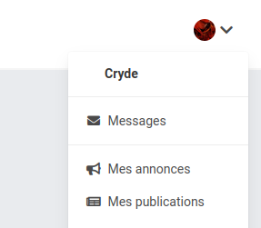
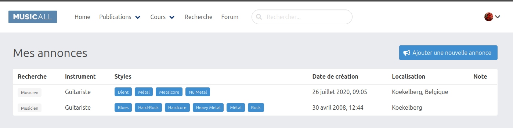
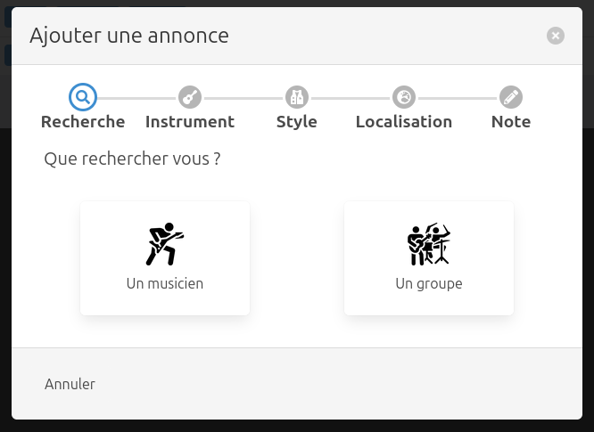
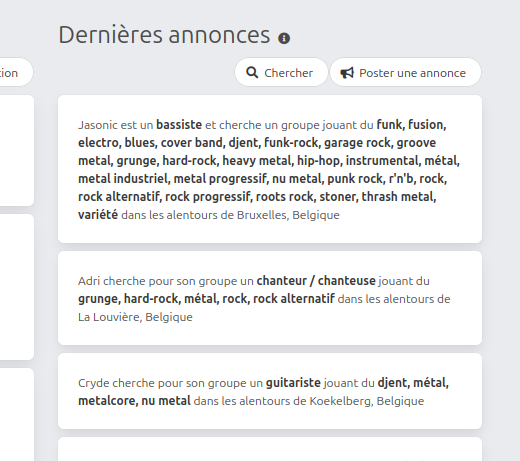

# How to use the Musician Announce

The announces are separated in 3 parts : the management, the search & the display of last announces in the homepage.

## Announce management

The user can manage it's own announces : list & create them.   
_Note: right now it not possible to edit or remove announce_

To access the list you have to be logged in.  
Then you click on your profile menu (top right) and then click on "Mes annonces"  :   

Once there you will see a list of your announces :  

From there you create a new one by clicking on "Ajouter une nouvelle annonce" 
This will open a modal that will guide you to create an announce.

For this particular part here are the interesting endpoints : 
- `api_instruments_get_collection` to get the list of instruments
- `api_styles_get_collection` to get the list of music styles
- `api_musician_announces_post` to create a new announce 
- `api_musician_announces_get_self_collection` to get the user own announces

## Last announces in the homepage

Visitor can see last announce the other user have created.  
This part is available in the homepage :  

You will note that there is buttons to create an announce (we have seen that in the previous point) and search for an announce.

For this particular part here are the interesting endpoints : 
- `api_musician_announces_get_last_collection` to get the last added musician announces

## Search 

Todo 